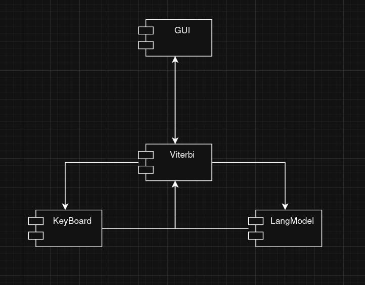
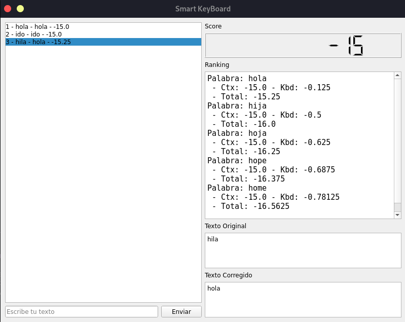
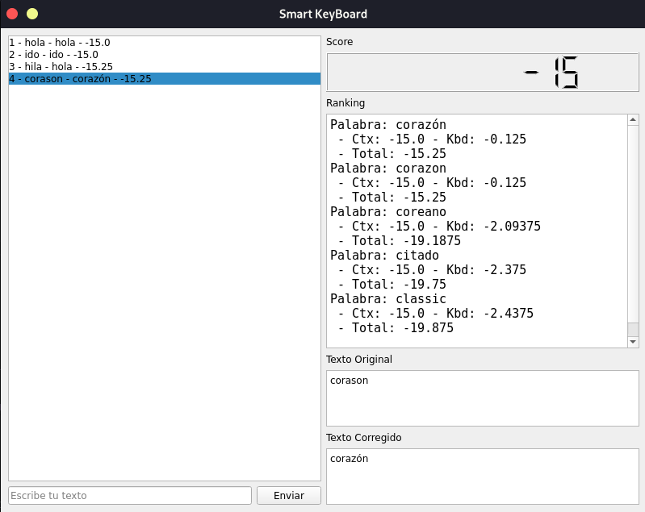
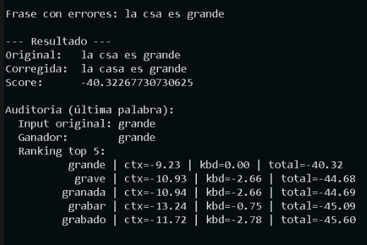

# HMM Smart Keyboard

>[!NOTE]
>¿Que es HMM Smart Keyboard?
>
>HMM Smart Keyboard es una herramienta que permite corregir errores en textos (Como por ejemplo, al escribir con un teclado tactil) mediante la utilización de un modelo de Markov Hidden Markov.

## Contenido
- [Marco Teórico](#Marco-Teorico)
- [Descripción y justificación del problema](#Descripción-y-justificación-del-problema)
- [Diseño de la aplicación](#Diseño-de-la-aplicación)
- [Código fuente](#Código-fuente)
- [Manual de usuario](#Manual-de-usuario)
- [Manual técnico](#Manual-técnico)
- [Escenarios de prueba](#Escenarios-de-prueba)

## Marco Teórico

Modelado (Capítulo 14):
Estados Ocultos ($X_t$): La letra real que el usuario quería escribir. 
Evidencia ($E_t$): La letra (o coordenada de pantalla) que el sistema detectó.
Modelo: HMM donde las transiciones representan la estructura del lenguaje (probabilidad de que 'u' siga a 'q'). 

## Descripción y justificación del problema  

> [!IMPORTANT]
> Problema:
>
> Dada una secuencia de teclas presionadas (que pueden ser erróneas debido a "dedos gordos" o ruido en la pantalla táctil), determinar la palabra correcta que el usuario intentó escribir. 

## Diseño de la aplicación


### Herramientas:

Se realiza con [Python](https://www.python.org) y UV de [astral.sh](https://docs.astral.sh/uv) esto por la facilidad de desarrollo en el lenguaje y el entorno adecuado que ofrece UV.

Para la interfaz gráfica se utiliza [PyQt5](https://www.riverbankcomputing.com/software/pyqt/intro), cumpliendo así uno de los requisitos del proyecto de mantener el todos sus componentes en un mismo lenguaje y entorno base. 

### Arquitectura

Se utiliza una arquitectura monolítica. Al tratarse de un proyecto sencillo no se considera necesario realizar una distinción fuerte entre componentes de la interfaz gráfica y lógica de negocio, aun así se separan las librerías de lógica en la carpeta `utils`, `GUI` contiene las librerías de la interfaz gráfica y `data` los archivos necesarios para el funcionamiento de la aplicación.

### Implementación 

**Matriz de Transición:** Basada en la frecuencia de bigramas del idioma (ej. en español, después de una 'q' es casi 100% seguro que viene una 'u'). 

**Matriz del Sensor:** Basada en la distribución del teclado QWERTY (si el usuario quería tocar 'S', es probable que toque 'A', 'W', 'D', 'Z' o 'X' por error). 

**Algoritmo clave a implementar:** *Algoritmo de Viterbi*. Encuentra la "Most Likely Explanation" (Secuencia de letras reales) dada la secuencia de teclas sucias observadas.  

**Algoritmo secundario:** *Predicción*. Calcular $P(X{t+1} | e{1:t})$ para sugerir cuál será la siguiente letra que el usuario va a escribir. 

## Código fuente 

Se puede ver el codigo fuente el las carpetas `src/hmm_smart_keyboard` del [repositorio](https://github.com/HASPIMA/hmm-smart-keyboard).

El funcionamiento y la explicacion de este esta en el [apartado tecnico](#manual-técnico)

## Manual de usuario 

### Instalacion y ejecución
Para desarrollo se requiere la instalacion de los siguientes paquetes:  

- [UV](https://docs.astral.sh/uv/getting-started/installation/) Gestor de proyecto y package manager

En algunos entornos linux con instalaciones minimas es necesario instalar los siguientes paquetes para la ejecución de la interfaz gráfica:

```bash
libxcb-xinerama0
libxcb-icccm4
libxcb-image0
libxcb-keysyms1
libxcb-render-util0
libxcb-randr0
libxcb-shape0
libxcb-sync1
libxcb-xfixes0
libxcb-shm0
libxcb-xkb1
libxkbcommon-x11-0
libxcb-xinerama0-dev
```

De momento, es requerido el siguiente [archivo](https://we.tl/t-oawXJBRm08) en la carpeta `/src/hmm_smart_keyboard/data/` para la ejecución de la aplicación.

Una vez configurado el entorno se puede ejecutar la aplicación con el comando:
```bash
uv run gui-sk
```
o si se desea usar sin interfaz grafica:
```bash
uv run python -m hmm_smart_keyboard.app
```

### Uso de la aplicación

#### Interfaz gráfica


Una vez se inicia la aplicacion aparece la anterior ventana. Con dos paneles principales el izquierdo es interactivo y el derecho muestra la informacion del procesamiento:

Panel izquierdo:

1. **Cuadro de texto:** Aqui se escribe el texto que se desea corregir.
2. **Boton**: Envia el texto a corregir al modelo de lenguaje. Tambien se puede presionar enter para enviar el texto.
3. **Vista de historial:** Muestra los resultados anteriores. Se pueden seleccionar para volver a ver las estadisticas.

Panel derecho:

4. **Texto original:** Muestra el texto ingresado por el usuario.
5. **Texto corregido:** Muestra el texto corregido por el modelo de lenguaje.
6. **Ranking:** Muestra las 5 predicciones mas probables segun el modelo y sus estadisticas:

- Palabra

- Ctx:

- Kbd:

- Total:

7. **Score:** Muestra el score obtenido por la palara _ganadora_

#### Cli / Consola


Se puede escribir directamente la palabra en la consola.
Al dar `enter` se envia al modelo de lenguaje y se muestran los mismos resultados anteriores.

Para salir se puede presionar `Ctrl+C` o `Ctrl+D` en la consola o escribir `salir` en la consola.

## Manual técnico



## Escenarios de prueba



